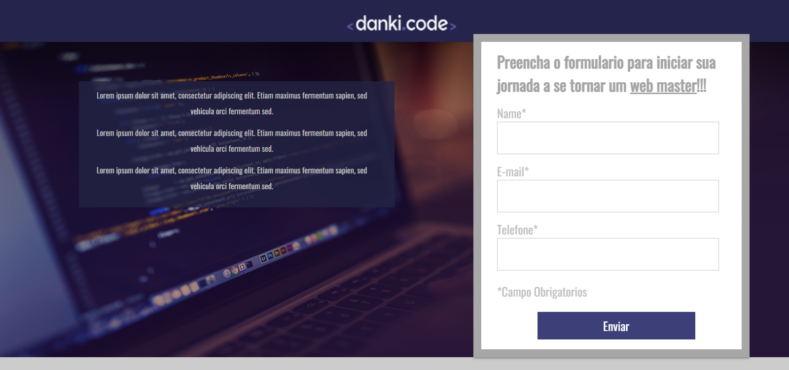
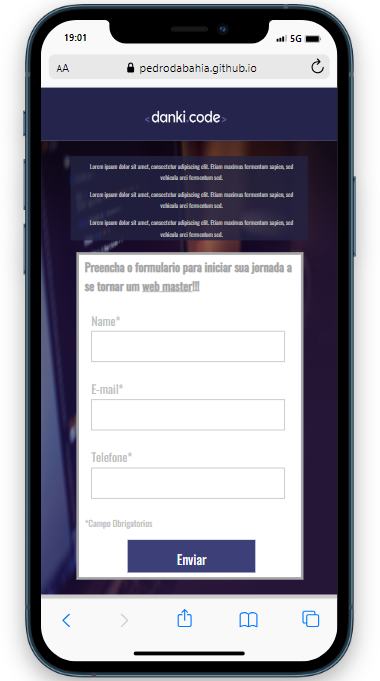
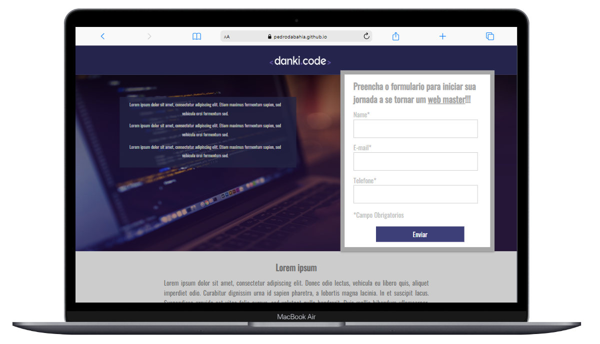

# Projeto_001

## :memo: Descrição
**Olá**, Seja Bem-vindo(a) ao site **Projeto 001** ,
este site é um site de treino, ou seja, não sera posto no ar pois tem como
principal objetivo o treino de ferramentas de desenvolvimento **front-end**.
O site foi projetado com informações verdadeiras e feitas com informações fornecidas no
curso da Danki Code(Local onde estudo), foi desenvolvido ultilizado os 2 pilares de desenvolvimento
web **o HTML e o css**

## :books: Funcionalidades
Como é umm site de treino e um dos primeiros quje desenvolvi, ele não contem diferenciais de back-end pois foi desenvolvido apenas ultilizando html e css, é um site responsivo, e contem um
formulario de contato que apesar de não estar ligado a um banco de dados e nem a um script, ele oferece algumas pequenas funcionalidades graficas.
**OBS: O formulario nâo esta 100% funcional pois não esta direcionado a nenhum banco de dados, ou seja, não é mandado nenhuma informação posta nele para um banco de dados. 
Mas o mesmo esta funcionando se for posto para teste de design.**

## :link: Links
[Click aqui para ver o Site](https://pedrodabahia.github.io/Projeto_001/)

## :framed_picture: Screenshots

  
  
  

## :wrench: Tecnologias Ultilizadas
Foram Ultilizades teconologias base de desenvolvimento front-end, são elas:
+ HTML5
+ CSS3
